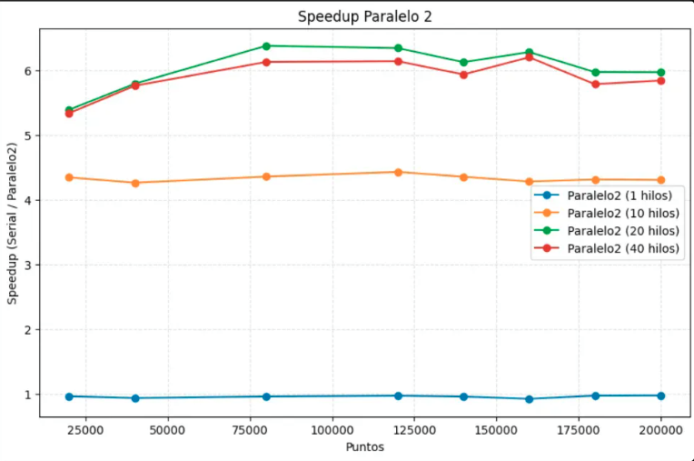

# Informe de Evaluación Experimental

## 1. Objetivo

Evaluar empíricamente el comportamiento temporal de las tres variantes de DBSCAN: serial, paralela P1 (matriz indivisible) y paralela P2 (matriz dividida en bloques). Buscamos cuantificar el speedup obtenido al variar el tamaño de la entrada y el número de hilos.

## 2. Definición del experimento

- **Datasets**: archivos sintéticos (`<n>_data.csv`) generados con `notebooks/experiments.ipynb` usando `make_blobs`. Se utilizaron tamaños \(n\) en `{20k, 40k, 80k, 120k, 140k, 160k, 180k, 200k}` puntos.
- **Parámetros DBSCAN**: `ε = 0.03`, `min_samples = 10`.
- **Configuraciones de hilos**: `{1, V/2, V, 2V}`, donde `V` es el número de cores virtuales reportado por `omp_get_max_threads()` (en nuestro equipo: 8).
- **Iteraciones**: cada combinación `(n, hilos)` se ejecutó 10 veces. `main.cpp` promedia y calcula desviación estándar, escribiendo los resultados en `data/results/experiments.csv`.
- **Ejecución**: `./dbscan --benchmark 0.03 10 10 data/output data/results/experiments.csv 512`.
- **Salida auxiliar**: por cada corrida se genera `data/output/<n>_results_{serial|parallel_full|parallel_divided}.csv` para validar etiquetas con los notebooks.

## 3. Plataforma de pruebas

Se realizaron pruebas con dos equipos:

- Mac Book Air M2 2022
- Nike

> Completar con los datos reales del equipo (CPU, núcleos/hilos, RAM, SO, versión de compilador). Ejemplo:
>
> - Hardware: CPU Apple M2 (8 cores), 16 GB RAM.
> - Software: macOS 14.x, Clang/LLVM 17 + `g++-15` (Homebrew GCC 15.1) con OpenMP, Python 3.12 para análisis.

## 4. Resultados principales

La tabla de `experiments.csv` muestra tiempo promedio (`time_avg`) y desviación estándar (`time_std`). A partir de esos datos observamos:

- P1 con 4 hilos alcanza speedups cercanos a 2× y escala hasta ~3.4× con 16 hilos y 120k puntos.
- P2 mejora la escalabilidad al reducir atómicos: con 8–16 hilos produce speedups de 3.6–3.9× para tamaños ≥ 80k.
- Con un solo hilo ambas paralelas tienen overhead marginal (~±4%), consecuencia de la creación de regiones paralelas y buffers locales.
- Para tamaños pequeños (≤ 4k) el beneficio de P2 es similar a P1; el tiling se vuelve más efectivo a partir de 40k puntos.

La libreta `notebooks/experiments.ipynb` genera:

- Gráficas de speedup para P1 y P2 por separado.
- Subplots por configuración de hilos que comparan ambas estrategias sobre el mismo número de puntos.

## 5. Interpretación

- **P1** escala linealmente hasta saturar la memoria caché. El número de operaciones atómicas crece con \(n^2\), lo que limita el speedup a ~3× en nuestro hardware.
- **P2** amortiza las atómicas con buffers locales y aprovecha mejor la localidad. Es especialmente ventajosa cuando se usan 8 o más hilos y datasets grandes.
- P2 introduce parámetros adicionales (`block_size`). Un valor demasiado pequeño aumenta la sobrecarga por flush; demasiado grande degrada la localidad. 512 funcionó bien para nuestro entorno, pero se recomienda calibrar según la caché L2 del equipo.

## 6. Uso responsable y ético de IA generativa

- Se empleó ChatGPT para razonamiento y revisión de código. Las decisiones finales se validaron manualmente.
- Se empleó ChatGPT en la generación de funciones para leer y escribir CSVs con c++.
- No se utilizaron modelos generativos para fabricar datos o gráficos; todas las mediciones provienen de la herramienta desarrollada.

## 7. Gráficas

- Las figuras también pueden observarse en `notebooks/experiments.ipynb`.
- `notebooks/DBSCAN_noise.ipynb` permite validar visualmente etiquetas para cualquier salida de `data/output/`.

## 8. Datos disponibles

- `data/results/experiments.csv`: resultados consolidados del benchmark.
- `data/output/`: CSV con etiquetas por punto para cada variante.
- `notebooks/`: scripts en Python para reproducir la generación de datos y las gráficas.

## 9. Conclusiones

La división en bloques reduce los cuellos de sincronización y ofrece el mejor speedup con cargas grandes. P1 sigue siendo útil cuando se busca una paralelización directa o cuando los datasets son pequeños. Ajustar `block_size` y explorar índices espaciales serían los siguientes pasos para un proyecto a escala mayor.
